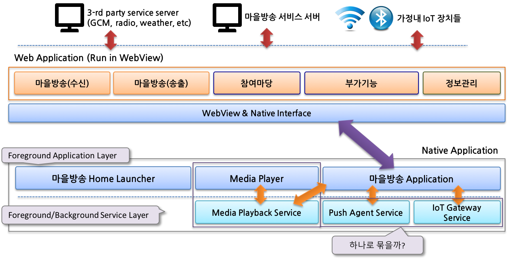

># 마을방송 전용단말 어플리케이션

## Overview
마을방송 서비스는 마을단위 또는 지역단위의 마을 방송을 위한 단말 서비스이다.
마을방송 전용 단말기를 통하여 마을방송 서비스, 인터넷 라디오, IoT Gateway와 연동 서비스 제공 등을 목표로 한다.

## 마을방송 전용단말 소프트웨어 구성  
아래의 그림과 같이 사용자 UI/UX는 웹뷰 기반에서 구동되는 Web application으로 구현된다.  
반면에 Push Notification, IoT gateway 연동, 미디어 서비스 및 런처 메인 화면 등은 Android Native로 구현되는 Hybrid 방식이다. 

### 1. Android Native 소프트웨어 구성  
#### 1) WebView & Native Interface
* 웹 어플리케이션과 Native 간 연동 인터페이스를 제공한다. 
* 상세 인터페이스 및 Javascript method는 [웹-Native간 연동인터페이스]()를 참조한다. 

#### 2) 마을방송 홈 런처 & 마을방송 서비스
* 마을방송 런처 메인화면이며 사용자 액션에 따라 필요한 기능을 수행한다. 
* 주요 Feature 
    * Digital 시계 
    * 날씨 
    * 달력(월 단위)
    * 마을방송 서비스 Shorcut 실행 기능 제공 
    * 안드로이드 어플리케이션 접근 기능 제공 

#### 3) 미디어 플레이어  
* Audio 플레이어이며, 초기 버전은 media playback service만 구현된다.  
* media playback service를 이용하여 mms protocol 기반 인터넷 라디오를 재생한다.  

#### 4) Push Agent  
* Custom push agent
* 마을방송 서비스 푸시 알림 제공 
    * 실시간 방송, 문자방송 및 일반 방송 알림  
    * 공지 등 알림 

#### 5) IoT Gateway  
* 초기 버전은 IoT Gateway에서 수집되는 데이터를 IoT 수집 서버로 relay 하는 역할을 담당할 수 있다. 
* IoT Gateway와 연동하여 IoT 장치들과 입/출력을 수행한다. 

### 2. 소프트웨어 구성과 프로젝트 Gradle 모듈 
|소프트웨어 구성 | 프로젝트 모듈명 | 비고 | 
|:----:|:----:|----|
| WebView & Native Interface | common_library | 인터페이스와 공통 기능 및 permission등 포함 |
| 마을방송 홈 런처 & 마을방송 서비스 | launcher | - |
| 미디어 플레이어 | media_player | media playback service |
| Push Agent | push_agent | push service, interface stack |
| IoT Gateway | iot_gateway | - |

 
